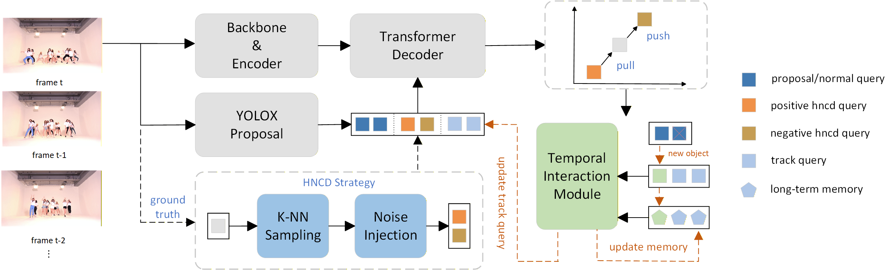

# HNCD

The official implementation of [MeMOTR: Long-Term Memory-Augmented Transformer for Multi-Object Tracking](https://arxiv.org/abs/2307.15700), ICCV 2023.

Author: zetton



**HNCD-MOTR** is a robust end-to-end multi-object tracker empowered by contrastive learning. We introduce a novel Hard Negative Contrastive Denoising (HNCD) training paradigm to enforce discriminative feature learning, thus effectively mitigating identity confusion in crowded scenes. Furthermore, we demonstrate that its learned representations can be efficiently reused as a high-quality feature basis for traffic anomaly detection, significantly accelerating convergence and improving detection accuracy.

## Installation

```shell
conda create -n HNCD python=3.10  # create a virtual env
conda activate HNCD               # activate the env
conda install pytorch==1.13.1 torchvision==0.14.1 torchaudio==0.13.1 pytorch-cuda=11.7 -c pytorch -c nvidia
conda install matplotlib pyyaml scipy tqdm tensorboard
pip install opencv-python
```

You also need to compile the Deformable Attention CUDA ops:

```shell
# From https://github.com/fundamentalvision/Deformable-DETR
cd ./models/ops/
sh make.sh
# You can test this ops if you need:
python test.py
```

## Data

You should put the unzipped CrowdHuman datasets into the `DATADIR/CrowdHuman/images/`. And then generate the ground truth files by running the corresponding script: [./data/gen_crowdhuman_gts.py](./data/gen_crowdhuman_gts.py). 

Finally, you should get the following dataset structure:
```
DATADIR/
  ├── DanceTrack/
  │ ├── train/
  │ ├── val/
  │ ├── test/
  │ ├── train_seqmap.txt
  │ ├── val_seqmap.txt
  │ └── test_seqmap.txt
  ├── SportsMOT/
  │ ├── train/
  │ ├── test/
  │ ├── train_seqmap.txt
  │ ├── val_seqmap.txt
  │ └── test_seqmap.txt
  |── so-tad/
  │ ├── train/
  │ ├── val/
  │ ├── test/
  │ ├── Appendix.txt
  └── CrowdHuman/
    ├── images/
    │ ├── train/     # unzip from CrowdHuman
    │ └── val/       # unzip from CrowdHuman
    └── gts/
      ├── train/     # generate by ./data/gen_crowdhuman_gts.py
      └── val/       # generate by ./data/gen_crowdhuman_gts.py
```


## Pretrain

We initialize our model with the official DAB-Deformable-DETR (with R50 backbone) weights pretrained on the COCO dataset, you can also download the checkpoint we used [here](https://drive.google.com/file/d/17FxIGgIZJih8LWkGdlIOe9ZpVZ9IRxSj/view?usp=sharing). And then put the checkpoint at the root of this project dir.

## Scripts on DanceTrack

### Training
Train HNCD with 4 GPUs on DanceTrack:
```shell
python -m torch.distributed.run --nproc_per_node=4 main.py --use-distributed --config-path ./configs/train_dancetrack.yaml --outputs-dir ./outputs/hncd_dancetrack/ --batch-size 1 --data-root <your data dir path>
```
if your GPU's memory is below than 32 GB, we also implement a memory-optimized version (by running option `--use-checkpoint`)
```shell
python -m torch.distributed.run --nproc_per_node=4 main.py --use-distributed --config-path ./configs/train_dancetrack.yaml --outputs-dir ./outputs/hncd_dancetrack/ --batch-size 1 --data-root <your data dir path> --use-checkpoint
```

### Submit and Evaluation
You can use this script to evaluate the trained model on the DanceTrack val set:
```shell
python main.py --mode eval --data-root <your data dir path> --eval-mode specific --eval-model <filename of the checkpoint> --eval-dir ./outputs/hncd_dancetrack/ --eval-threads <your gpus num>
```

## Scripts on SportsMOT and other datasets

You can replace the `--config-path` in [DanceTrack Scripts](#scripts-on-dancetrack). E.g., from `./configs/train_dancetrack.yaml` to `./configs/train_sportsmot.yaml` for training on SportsMOT.


## Results

### Multi-Object Tracking on the DanceTrack test set

| Methods                  | HOTA | DetA | AssA | checkpoint                                                   |
| ------------------------ | ---- | ---- | ---- | ------------------------------------------------------------ |
| HNCD                   | 71.8 | 83.5 | 61.9 | [Google Drive](https://drive.google.com/file/d/13XjwQwKs6juhuXntZWM0LU6quawh7VIp/view?usp=drive_link) |

### Multi-Object Tracking on the SportsMOT test set

| Methods                  | HOTA | DetA | AssA | checkpoint                                                   |
| ------------------------ | ---- | ---- | ---- | ------------------------------------------------------------ |
| HNCD                   | 71.7 | 84.2 | 61.2 | [Google Drive](https://drive.google.com/file/d/1H58SpBb_DcjvAvEPTo5BXnAki89UUxMG/view?usp=drive_link) |

### Multi-Object Tracking on the AICity22 Track 1 validation set

| Methods                  | HOTA | DetA | AssA | checkpoint                                                   |
| ------------------------ | ---- | ---- | ---- | ------------------------------------------------------------ |
| HNCD                   | 90.1 | 94.5 | 85.9 | [Google Drive] |
